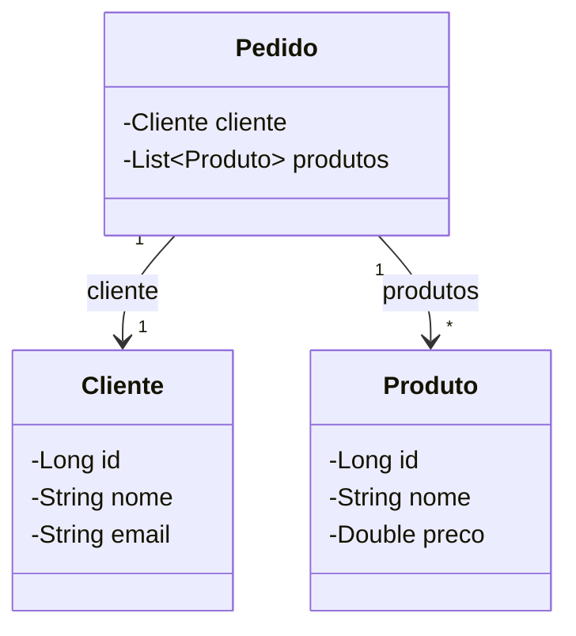

# API RESTful - Ecommerce 

## Diagrama de Classe:

```mermaid
classDiagram
    class Pedido {
        -Cliente cliente
        -List~Produto~ produtos
    }

    class Cliente {
        -Long id
        -String nome
        -String email
    }

    class Produto {
        -Long id
        -String nome
        -Double preco
    }

    Pedido "1" --> "1" Cliente : cliente
    Pedido "1" --> "*" Produto : produtos
```
